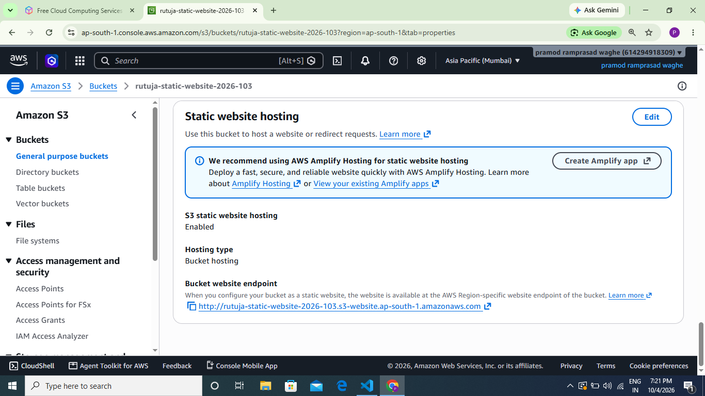
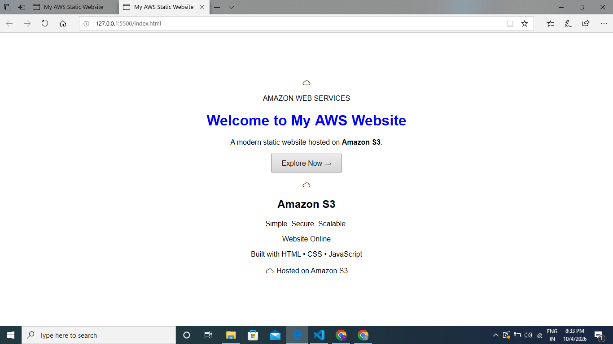
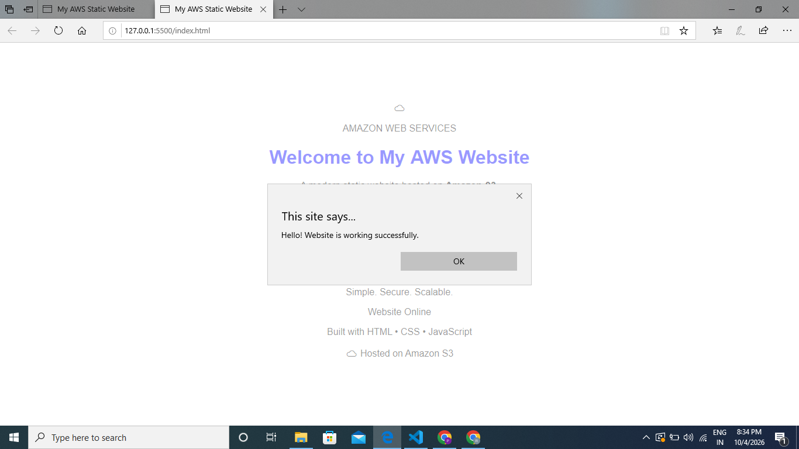

# 🌐 Automated Static Website Hosting Using AWS SDK

## 📌 Project Overview

This project demonstrates how to deploy and host a static website on **Amazon S3** using **Python and the AWS SDK (boto3)**.

Instead of manually uploading website files, the Python script automates the deployment process by uploading the HTML, CSS, and JavaScript files to an Amazon S3 bucket.

---

## 🎯 Objective

To build and deploy a static website using:

* Amazon S3
* Python
* boto3
* AWS CLI
* HTML
* CSS
* JavaScript

The project demonstrates basic **AWS cloud deployment, automation, and static website hosting**.

---

## 🏗️ Architecture / Workflow

```text
Local Website Files
        ↓
Python + boto3
        ↓
Amazon S3 Bucket
        ↓
S3 Static Website Hosting
        ↓
Web Browser
```

---

## ☁️ AWS Services & Technologies

| Service / Technology | Purpose                      |
| -------------------- | ---------------------------- |
| Amazon S3            | Store and host website files |
| Python               | Automate deployment          |
| boto3                | Connect Python with AWS      |
| AWS CLI              | AWS command-line operations  |
| HTML                 | Website structure            |
| CSS                  | Website styling              |
| JavaScript           | Website interaction          |

---

## 📂 Project Structure

```text
AWS-static-website/
│
├── index.html
├── style.css
├── script.js
├── upload_website.py
├── README.md
├── .gitignore
│
└── screenshots/
    ├── 01-s3-bucket.png
    ├── 02-boto3-upload.png
    ├── 03-s3-files.png
    ├── 04-Static-website-hosting.png
    ├── 05-bucket-policy.png
    ├── 06-website-homepage.png
    └── 07-live-website.png
```

---

## ⚙️ Implementation Steps

### 1. Create the Website

Created a static website using:

* `index.html`
* `style.css`
* `script.js`

### 2. Configure AWS

Created an Amazon S3 bucket and configured it for static website hosting.

### 3. Install boto3

Installed the AWS SDK for Python:

```bash
pip install boto3
```

### 4. Configure AWS CLI

Configured AWS CLI credentials to allow Python to communicate with AWS.

```bash
aws configure
```

### 5. Upload Website Using Python

The `upload_website.py` script uploads the website files to the S3 bucket using boto3.

### 6. Configure Static Website Hosting

Configured the S3 bucket for static website hosting with:

```text
Index document: index.html
```

### 7. Configure Bucket Policy

Configured the required S3 bucket permissions so the website can be accessed through the public website endpoint.

### 8. Test the Website

Opened the S3 website endpoint in a web browser and verified that the website was accessible.

---

## 🖥️ Website Features

* Responsive static webpage
* HTML/CSS/JavaScript implementation
* Interactive JavaScript button
* Automated S3 file upload
* AWS S3 static website hosting
* Python-based deployment automation

---

## 📸 Screenshots

### 1. S3 Bucket


### 2. boto3 Upload


### 3. Files Uploaded to S3


### 4. Static Website Hosting



### 5. Bucket Policy


### 6. Website Homepage



### 7. Live Website



---

## 🚀 How to Run the Project

### Prerequisites

Install:

* Python 3.x
* AWS CLI
* boto3
* AWS account

### Clone the Repository

```bash
git clone https://github.com/rutujadandwate4545-art/AWS-static-website.git
```

```bash
cd AWS-static-website
```

### Install boto3

```bash
pip install boto3
```

### Configure AWS CLI

```bash
aws configure
```

Enter your AWS credentials and preferred AWS region.

### Run the Deployment Script

```bash
python upload_website.py
```

After successful deployment, access the website using the configured S3 static website endpoint.

---

## 🔐 Security Note

AWS credentials and sensitive information should **never** be uploaded to GitHub.

The project uses `.gitignore` to prevent sensitive files such as:

```text
.env
.aws/
*.pyc
.venv/
venv/
```

from being committed.

---

## 📚 Key Learnings

Through this project, I learned:

* Amazon S3 bucket management
* Static website hosting on AWS
* Python boto3 automation
* AWS CLI configuration
* S3 bucket policies
* Website deployment
* Git and GitHub version control
* Basic cloud deployment workflow

---

## 👩‍💻 Author

**Rutuja Dandwate**

BSc Computer Science Graduate
Aspiring Cloud / Python Developer

---

## ⭐ Project Highlights

**Cloud:** AWS
**Service:** Amazon S3
**Language:** Python
**SDK:** boto3
**Frontend:** HTML, CSS, JavaScript
**Version Control:** Git & GitHub
