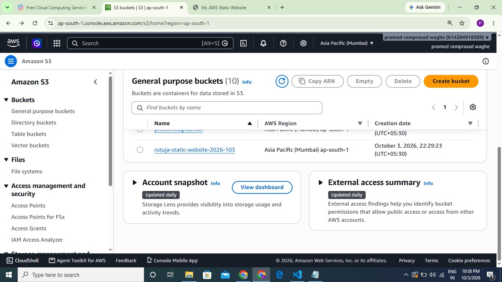
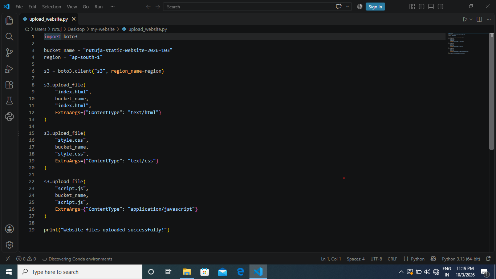
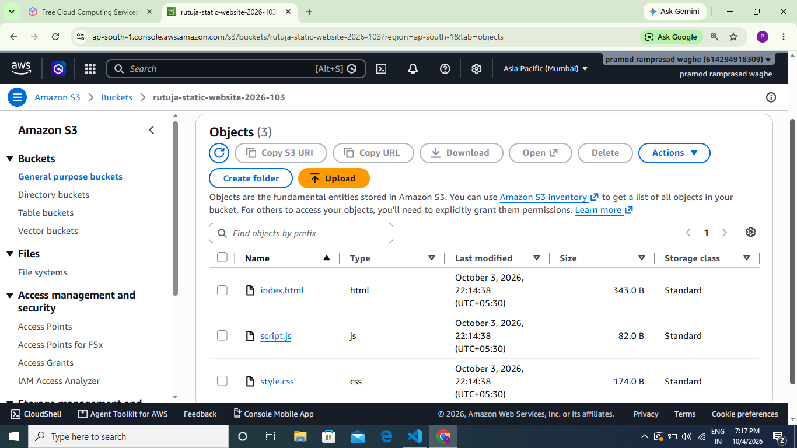
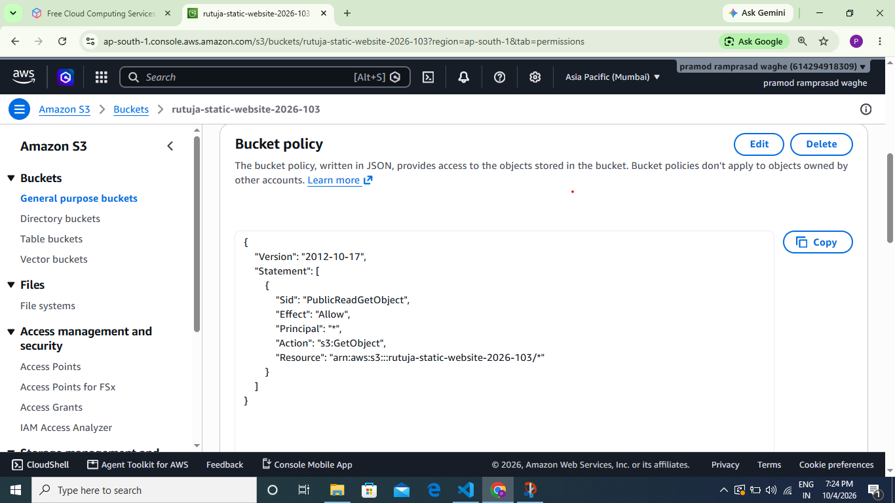

# Automated Static Website Hosting Using AWS SDK

## Project Objective

The objective of this project is to deploy a static HTML, CSS, and JavaScript website to Amazon S3 using Python and the AWS SDK for Python (boto3).

## AWS Services and Technologies Used

- Amazon S3
- Python
- boto3
- AWS CLI
- HTML
- CSS
- JavaScript

## Architecture / Workflow

Local Website Files
        ↓
Python + boto3
        ↓
Amazon S3 Bucket
        ↓
S3 Static Website Hosting
        ↓
Web Browser

## Website Files

- `index.html` – Website structure
- `style.css` – Website styling
- `script.js` – JavaScript functionality
- `upload_website.py` – Uploads website files to S3 using boto3

## Features

- Automated website deployment using Python
- Uploads HTML, CSS, and JavaScript files to Amazon S3
- S3 static website hosting
- Public website endpoint
- Interactive JavaScript button

## Implementation Steps

1. Created HTML, CSS, and JavaScript website files.
2. Installed Python and boto3.
3. Configured AWS CLI.
4. Created an Amazon S3 bucket.
5. Created a Python script using boto3.
6. Uploaded website files to Amazon S3.
7. Enabled S3 static website hosting.
8. Configured the required S3 bucket policy.
9. Tested the live website using the S3 website endpoint.

## Screenshots

### 1. S3 Bucket

### 2. Python + boto3 Upload

### 3. Uploaded Website Files

### 4. Static Website Hosting

### 5. S3 Bucket Policy

### 6. Live Website

## How to Run / Deploy

1. Install Python.
2. Install boto3:
   `pip install boto3`
3. Configure AWS CLI with an AWS account.
4. Update the bucket name in `upload_website.py`.
5. Run:

   `python upload_website.py`

6. Open the S3 static website endpoint in a web browser.

## Security Practices

- AWS credentials are not stored in the source code.
- Sensitive AWS configuration files are excluded using `.gitignore`.
- AWS access keys and secret keys must never be uploaded to GitHub.
- IAM permissions should follow the principle of least privilege.
- Public S3 access is used only because it is required for this static website endpoint.

## Key Learnings

- Learned how Amazon S3 static website hosting works.
- Learned how to upload files using Python and boto3.
- Learned how to configure S3 bucket policies.
- Learned how to use AWS CLI.
- Learned basic AWS security practices.
- Learned how to automate website deployment using the AWS SDK.

## Result

The static HTML, CSS, and JavaScript website was successfully uploaded to Amazon S3 and deployed using S3 static website hosting.